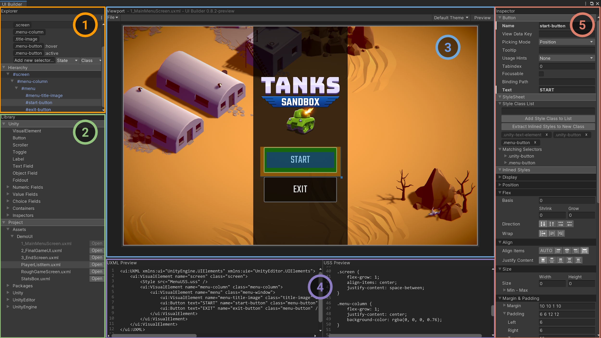

# UI Builder

The **UI Builder** lets you visually create and edit UI assets (UXML and USS) for use with the **UI Toolkit** (formally UIElements). Once the package is installed, the UI Builder window can be opened via the **Window > UI > UI Builder** menu, or double-clicking on a `.uxml` asset in the Project Browser.

## Overview

The UI Builder window has the following sections:

||Section:|Function:|
|-|-|-|
|| [Explorer](#explorer)|Access components of open documents.|
|| [Library](#library)|Find available elements.|
|| [Viewport](#viewport)|Preview and edit the UI.|
|| [Code Previews](#code-previews)|See the USS and UXML files that UI Builder generates. |
|| [Inspector](#inspector)|Edit properties of elements and USS selectors.|

## Explorer

The **Explorer** is similar to the [Hierarchy window](https://docs.unity3d.com/Manual/Hierarchy.html) in the Unity Editor. It gives you access to all components of any open documents.

The **Explorer** has two sections: the StyleSheet and the Hierarchy.

### StyleSheet

The **StyleSheet** section lists all of the USS selectors in the main USS document. Use it to create and edit selectors.

> [!NOTE]
> UI Builder supports one USS style sheet per UXML document.

#### Creating new selectors
To create a new selector from the StyleSheet section, do one of the following:

1. In the **Explorer**, click the **StyleSheet** header.
1. In the **Inspector**, enter the selector name in the **StyleSheet > Selector** field.
1. Click the **Create new USS Selector** button.

You can also create simple or complex selectors directly in the **Explorer**.

To create a simple selector:

1. In the **Explorer**, beside the **Add new selector...** text field, select the pseudo **State** (for example, **Hover** or **Active**).
1. Enter the class name in the **Add new selector...** field.
1. Press Enter.

To create a complex selector:

1. In the **Explorer**, beside the **Add new selector...** text field, change **Type** to **Complex**.
1. Enter the full selector name in the **Add new selector...** field.
1. Press Enter.

UI Builder converts any class names in selectors into "pills" that you can drag onto elements in the **Viewport** or **Hierarchy** to apply the classes.

#### Editing selectors

Select a selector from the list to open it in the **Inspector**, where you can edit its properties. Any elements that the selector affects are highlighted in the **Viewport**.  

### Hierarchy

The **Hierarchy** section displays a live tree view of a UXML document's hierarchy.

You can select elements to edit their properties in the **Inspector**. You can drag elements in the **Hierarchy** to re-parent them.

Elements appear in the tree according to their `name` attributes. If an element's `name` attribute is not set, it  appears according to its C# type. You can double-click an element to quickly rename it.

Click the **&#8942;** icon in the top right corner of the Explorer toolbar to access a menu of display options for elements in the Hierarchy.

- Select **Type** to force the **Hierarchy** to display each element's C# type, regardless of whether it has a name.
- Select **Class List** to display each element's style class list next to its **Hierarchy** entry.

## Library
The **Library** pane is similar to the [**Project** window](https://docs.unity3d.com/Manual/ProjectView.html) in the Unity Editor. It lists available UI elements.
- The **Unity** section lists the standard elements that Unity provides. These elements include standard styling that works for all supported Unity Editor and run time themes.
- The **Project** section lists custom `.uxml` assets in the Project. It also lists any custom C# elements that inherit from `VisualElement` and have their `UxmlFactory` set up to be instantiable via UXML).

To instantiate an element, do one of the following:
- Drag it into the **Hierarchy** section of the **Explorer** pane.
- Drag it onto the Canvas in the **Viewport**.
- Double-click it. This adds the element as a sibling of the currently selected element. If nothing is selected, the element is added at the root.

To preview any element in the **Library**, hover over it. The preview appears to the right of the **Library** pane.

## Viewport

The **Viewport** displays the output of a UXML document on a resizable edit-time Canvas provided by UI Builder.

- The title bar displays the name of the currently loaded document. An asterisk **&#42;** next to the name indicates unsaved changes.
- The toolbar contains menus of UI Builder commands, **Viewport** settings, and the **Preview** button.
- The Canvas is where you edit, preview, and interact with UI.

> [!NOTE]
> The Canvas size, and all other Canvas attributes, only apply to the UI Builder authoring environment. They are not saved in the document itself.

### Viewport toolbar menus

The **Viewport** toolbar contains the following menus:

|Menu:| Function:|
|-|-|
|**File**   | Create a **New** document, **Save/Save As** the current document, or **Open** another document.  |
|**Theme**   | Switch between the **Dark** and **Light** Editor themes, or the **Runtime** theme, to see how your UI looks in each theme. |

### Resizing the Canvas

To resize the Canvas from the **Viewport** drag the handles on left, right, or bottom.

To resize the Canvas from the **Inspector**:

1. In the **Explorer** pane, select the **Hierarchy** element.
1. In the **Inspector**, set the **Canvas Size > Width/Height** values.

### Interacting with UI in the Canvas

To select an element, click it. UI Builder highlights it in the Canvas.

To resize the selected element, use its drag handles:

- If the element's  **Position > Position** setting is **Relative**, you can only adjust its height and width.
- If the element's  **Position > Position** setting is **Absolute**, you have full control over how you resize and position the element.

 > [!NOTE] Absolute positioning is not recommended because it bypasses UI Toolkit's automatic layouting functionality.

### Setting a background

To set an edit-time background for the Canvas:

1. In the **Explorer** pane, select the **Hierarchy** element.
1. In the **Inspector** choose the **Canvas Background** mode.
  - **None:** No background
  - **Color:** A color that you choose using a Unity color picker.
  - **Image:** An image that you choose using a Unity object picker.
  - **Camera:** A live feed from a **Camera**. This is useful for seeing run time UI in context without launching a full game.
1. You can also adjust the background's **Opacity**.

### Previewing UI

Use the **Preview** button in the **Viewport** toolbar to preview your UI as though it were running on a device.

Activating Preview mode removes the selection layer that allows you to select elements on the Canvas by clicking them.

While in Preview mode, you can interact with the UI the way a user might. For example, you can click buttons, type in text fields, and expand and collapse foldout controls.

## Code Previews

As you build your UI, UI Builder automatically generates the underlying UXML and USS, and displays them in the **UXML Preview** and **USS Preview** panes.

## Inspector

The UI Builder **Inspector** is similar to the Unity [**Inspector** window](https://docs.unity3d.com/Manual/UsingTheInspector.html). Use it to change the properties and styles of the selected element or USS selector.

### Editing an element's attributes

When you select a visual element in the Canvas or the **Hierarchy**, you can change its UXML attributes (for example, **Name**, **Tooltip**, and **Text**) in the **Attributes** section of the **Inspector**. Attributes are per-element, and cannot be shared.

The **Attributes** section header displays the selected element's type. The section only appears when you select a visual element. It does not appear when you select a USS selector.

### Editing an element's StyleSheet styles

USS selectors allow you to share styles between multiple elements. When you change a shared style, you automatically update every element that uses it.

USS selectors can match elements by name, style class, C# type, a combination of all three, and/or a parent/child relationship.

However, the easiest way to share styles is to assign a style class to one or more elements and create a simple selector. For example, you might assign a class called `my-red-button`, and create a corresponding selector called `.my-red-button`.

Use the **StyleSheet** section of the **Inspector** to apply styles from the StyleSheet on the selected element.

A selected element's styles from matching selectors appear in the **StyleSheet > Matching Selectors** list.

#### Adding style classes to elements

To add a style class to an element:

1. Select the element.
1. In the **Inspector**, enter the style class name in the **Style Class List** field.
1. Press the **Add Style Class to List** button.

If a matching selector already exists, you should see the effect of the styles immediately.

#### Creating selectors for style classes

The bottom of the **StyleSheet > Style Class List** section displays a pill for each style class assigned to the selected element.

To create a selector:

- Double-click a pill. If a selector already exists, double-clicking the pill selects it.

You can also create selectors and style classes, from [inlined styles](#editing-inlined-styles-for-elements-and-USS-selectors) that you created for the selected element.

To create a selector and style class from inlined styles:

1. In the **StyleSheet > Style Class List** section of the **Inspector**, type the new selector's name.
1. Use the **Extract Inlined Styles to New Class** button to create a new USS selector and also add the matching style class to the current element.

The new selector appears in the **StyleSheet** section of the **Explorer**.

#### Removing styles from elements

The bottom of the **StyleSheet > Style Class List** section displays a pill for each style class assigned to the selected element. Click the **X** on any pill to remove the style from the element. For example, you might remove the default styling on a Unity-provided button.

### Editing inlined styles for elements and USS selectors

When you select a visual element or a USS selector, you can add and edit its inlined styles from the **Inlined Styles** section of the **Inspector**.

- For elements, inlined styles override styles coming from the StyleSheet. They are stored in the UXML document as inline styles.
- For USS selectors, inlined styles are added as properties to the USS rules in the StyleSheet.

When you change an inlined style for an element or a USS selector, a solid border appears next to the property in the **Inlined Styles** section of the **Inspector**, and the property name appears in bold.
